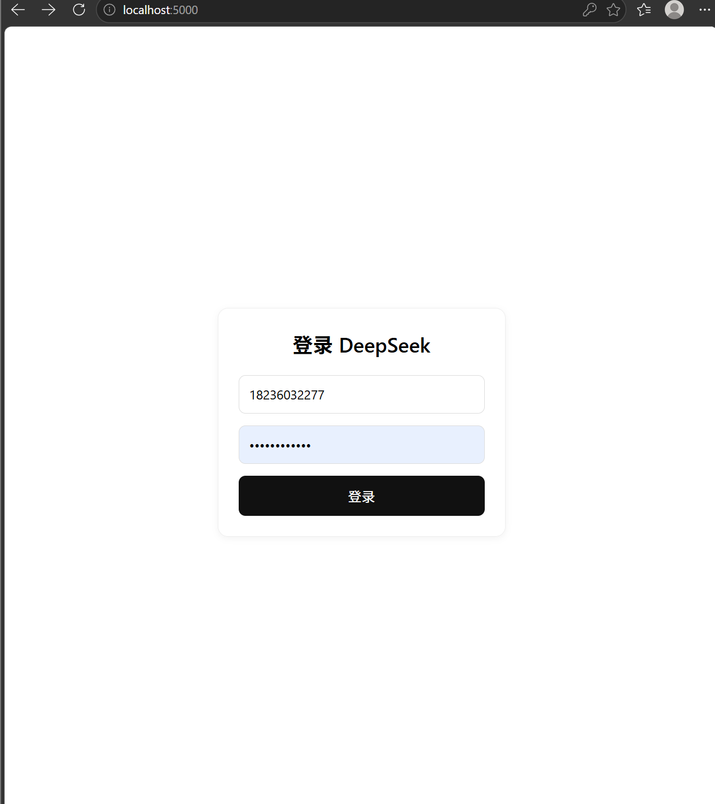
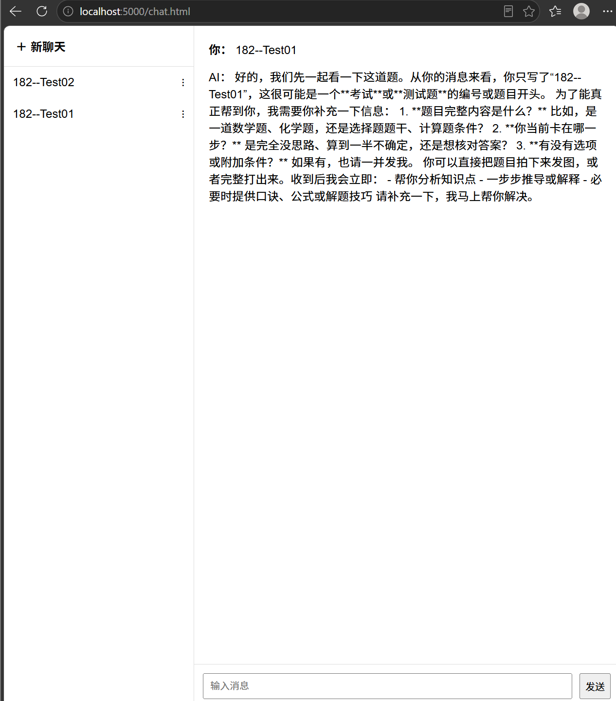

# SeekChat

SeekChat is a lightweight ChatGPT-style web app powered by the DeepSeek API. It includes a Node.js/Express backend, MongoDB persistence, and a static HTML/CSS/JavaScript frontend.

## Screenshots





## Features

- User login with MongoDB-backed accounts
- Create, rename, delete, and pin conversations
- Stream AI responses token by token
- Save conversation history
- Simple browser UI served by Express

## Tech Stack

- Node.js
- Express
- MongoDB and Mongoose
- DeepSeek API through the OpenAI-compatible SDK
- HTML, CSS, and vanilla JavaScript

## Project Structure

```text
backend/
  server.js              Express entry point
  routes/
    auth.js              Login API
    chat.js              Conversation and streaming chat APIs
  models/
    User.js              User model
    Conversation.js      Conversation model
  public/
    login.html           Login page
    chat.html            Chat page
screenshots/
  login.png
  chat.png
```

## Requirements

- Node.js 18 or newer
- MongoDB running locally or a MongoDB connection string
- DeepSeek API key

## Setup

```bash
cd backend
npm install
copy .env.example .env
```

Edit `backend/.env`:

```env
PORT=5000
MONGODB_URI=mongodb://localhost:27017/DeepSeek
DEEPSEEK_API_KEY=your_deepseek_api_key_here
DEEPSEEK_BASE_URL=https://api.deepseek.com
DEEPSEEK_MODEL=deepseek-chat
```

Start the backend:

```bash
npm start
```

Open:

```text
http://localhost:5000
```

## Creating a Test User

This project currently expects users to already exist in MongoDB. You can insert a test user in `mongosh`:

```javascript
use DeepSeek
db.users.insertOne({ username: "test", password: "123456" })
```

Then log in with:

```text
username: test
password: 123456
```

## API Overview

```text
POST   /api/auth/login
POST   /api/chat/new
GET    /api/chat/conversations/:userId
GET    /api/chat/history/:conversationId
POST   /api/chat/send
PUT    /api/chat/rename/:conversationId
PUT    /api/chat/pin/:conversationId
DELETE /api/chat/delete/:conversationId
GET    /api/health
```

## Checks

```bash
cd backend
npm test
```

The current test command performs syntax checks for the backend entry point and route files.

## Notes

- Do not commit `.env`; it is ignored by `.gitignore`.
- Passwords are currently stored as plain text for compatibility with the original demo data. Use password hashing before deploying this as a real public application.
